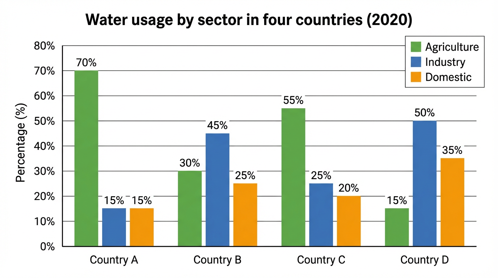

# IELTS Task 1 Report Practice

**日付**: 2026-02-24
**練習回数**: #2
**今日の意識ポイント**: ① 冠詞（可算単数 → a/an） ② スペル見直し1分 ③ 動名詞主語 → 単数扱い

---

## 問題文 / データの説明

> The bar chart below shows the percentage of water used by three different sectors (agriculture, industry, and domestic) in four countries in 2020.
>
> Summarise the information by selecting and reporting the main features, and make comparisons where relevant.
>
> Write at least 150 words.

**データ種類**: [x] 棒グラフ

| | Agriculture | Industry | Domestic |
|---|---|---|---|
| Country A | 70% | 15% | 15% |
| Country B | 30% | 45% | 25% |
| Country C | 55% | 25% | 20% |
| Country D | 15% | 50% | 35% |

---

## 構成メモ（3分）

- **全体傾向（Overview — 方向まで書く）**:
- **Detail 1で述べること**:
Country A and C uses a lot of water on agriculture
For country A, 70 % of water is used for Agriculture.
50 % of use in  the country C s in Agriulture
- **Detail 2で述べること**:
COuntry B and D have more focus on Industry

**繰り返しそうな語の3語セット**:
- ○○ = ○○ = ○○

---

## Report（17分 — 170語を目安に止める）

### Introduction（問題文の言い換え）19
This bar graph shows the percentages of the usage for each purpose in the different four countries in 2020.

### Overview（全体傾向 — 最重要パラグラフ）
The country A and C focused on agriculture, while the water usage is concentrated in industry in the other countries.
7:00

### Detail 1
For the country A and C, in 2020, huge proportion of water was consumed for agriculture.
Precisely, the country A used 70% of annual consumption into agriculture, though the other usages only ocuppied 15% for each.
Additionally, the country C's usage for agriculture was 55%. Althogh this figure was less than that of the country A, it was still a significant number.
11:00

### Detail 2
On the other hands, the other countries used relatively half of the portion of water into industry.
The country B used 45% of annual consumption for the industry sector, which was larger than the figures of different sections.
Also, country D's usage concentrated on industry with the ratio, 50%. 
見直し込みで19:30で終了

---

## 語数: ___語（目標: 150–180語）

---

## 自己レビュー（5分）

### スペルチェック（最初の1分 — 文字面だけ見る）
- [ ] 確認した

### チェック項目
- [ ] 問題文をそのままコピーせず言い換えたか
- [ ] Overviewで全体傾向を2-3点（方向まで）述べたか
- [ ] 主要なデータポイントを取り上げたか
- [ ] 自分の意見を書いていないか（What だけ。Why は書かない）
- [ ] 時制: 2020年のデータ → 過去形で統一しているか
- [ ] 冠詞: 可算名詞の単数に a/an がついているか
- [ ] SVA: 動詞の主語は単数？複数？

### 修正箇所

| 元の文 | 修正後 | 修正理由 |
|---|---|---|
| | | |
| | | |

---

## 振り返り（2分）

**良かった点**:

**改善が必要な点**:

**次回の意識ポイント**:

**新しく使った/学んだ表現**:
-
-

---
---

# ↓ ここから先は FB を受けた後に使う ↓

---

## 添削（FB を踏まえて、時間制限なしでじっくり直す）

### 添削の観点
1. **削れる文はないか？**（2文→1文に凝縮できないか）
2. **FBで指摘されたミスを自分の手で直す**
3. **170語以内に収まるか？**

### 添削後のレポート

（ここに元のレポートをコピーして、直接修正する）

### Introduction（問題文の言い換え）19
This bar graph shows the percentages of the usage for three purposes, agriculture, industry and domestic, in the different four countries in 2020.

### Overview（全体傾向 — 最重要パラグラフ）
Country A and C heavily focused on agriculture, while the water usage in the other countries was concentrated in industry. Overall, the consumptions for domestic  were smallest over the countries.
7:00

### Detail 1
For country A and C, in 2020, a huge proportion of water was consumed for agriculture.
Precisely, country A used 70% of annual consumption into agriculture, though the other usages only occupied 15% respectively.
Additionally, country C's usage for agriculture was 55%. Although this figure was less than that of country A, it was still a significant number.
11:00

### Detail 2
On the other hand, the other countries used relatively half of the portion of water into industry.
Country B used 45% of annual consumption for the industry sector with 30% for agriculture and 35% for domestic.
Also, Country D's usage concentrated on industry with the ratio, 50%. It is intresting that the share for the domestic usage is 35% which is the largest figure in all these countries

### 添削で気づいたこと
- showsの他にillustratesがあるの忘れてた。representとかdescribeとか、色々あるよね
- each purposeを4つ分具体的にあげていれば文字数を脳死で稼げて安全だった
- domesticに言及しなかったのは本当に間違いない。focused onとか、情報量が少なすぎるね。how much they focused をちゃんと副詞？で表現するべき。Largily, heavily, significantly, enourmously.　ここら辺の語彙を増やせばいろんなパターンにも対応できそう
- %に対して使える同士のストックが少なすぎた。devote,　allocateももちろんそうだし、occupy, account for, dominate?とか、色々あったね。
- ちゃんと数字に言及しているのが偉い。文が長くなりすぎないようにうまく就職したり、分子構文で付け加えている点を見習いたい.　逆に数字まで言及してれば自然に文字数が良くなりそう。

---

## クリーンリライト（何も見ずに17分で書く）

### Introduction

### Overview

### Detail 1

### Detail 2

---

## 語数: ___語

## リライトの振り返り

**添削の内容が反映できたか**:

**まだ残っている課題**:
