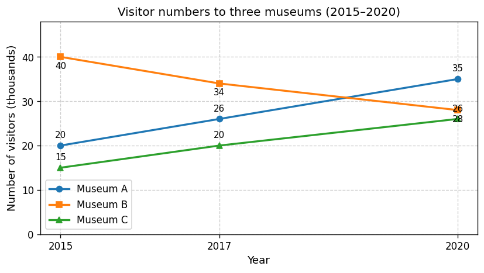

# IELTS Task 1 Report Practice

**日付**: 2026-03-02
**練習回数**: #5（Task 1）
**今日の意識ポイント**: ① 増減の方向をデータと照合（Detail を書いたら必ず確認） ② Overview で方向まで（何が増えた・減った） ③ 冠詞（単数なら a/the のどちらか）・時制（過去データは過去形）

---

## 問題文 / データの説明

> The line graph below shows the number of visitors (in thousands) to three museums in a city between 2015 and 2020.
>
> Summarise the information by selecting and reporting the main features, and make comparisons where relevant.
>
> Write at least 150 words.

**データ種類**: [x] 折れ線グラフ  [ ] 棒グラフ  [ ] 円グラフ  [ ] 表  [ ] 地図  [ ] プロセス図

**データ（画像が見えない場合用）**

| 博物館     | 2015（千人） | 2017（千人） | 2020（千人） | 傾向 |
|------------|--------------|--------------|--------------|------|
| Museum A   | 20           | 26           | 35           | ↑   |
| Museum B   | 40           | 34           | 28           | ↓   |
| Museum C   | 15           | 20           | 26           | ↑   |

---

## 構成メモ（3分）

- **全体傾向（Overview — 方向まで書く）**:
The number of visiter for Museum A and C increased 
Museum B decreased it's number 

- **Detail 1で述べること**（↑ 増えたもの）:
The figure of visiter for Museum A and C increased markedly.
In 2015, the figure of museum A was 20 thousands which was in the second place among three museums. However, after 2015, the number increased gradually and reached 35 thousands in 2020. As for museum C, although the smallest number of people visited in every year, the figure itself incresed steadily. In detail, the number in 2015 was 15 thousands and in 2020 the figure became 26 thousands.

- **Detail 2で述べること**（↓ 減ったもの）:

**繰り返しそうな語の3語セット**:
- visitor = attendee = number of people
- increase = rise = grow
- decrease = fall = decline

---

## Report（17分目標 — 170語を目安に止める）

### Introduction（問題文の言い換え）
The line chart in the picture represents the number of people (in thousands) who visited three museums in a city in 2015, 2017 and 2020.

### Overview（全体傾向 — 最重要パラグラフ）
The number of visiters to Museum A and C increased significantly over the period, though that of Museum B decreased sharply after the five years. Although Museum B was the most popular one, declining significantly, it was surpassed by Museum A and ended up with the second place among three museums.

### Detail 1
The figure of visiter for Museum A and C increased markedly.
In 2015, the figure of museum A was 20 thousands which was in the second place among three museums. However, after 2015, the number increased gradually and reached 35 thousands in 2020. As for museum C, although the smallest number of people visited in all theree years, the figure itself incresed steadily. In detail, the number in 2015 was 15 thousands and in 2020 the figure became 26 thousands.

### Detail 2
On the other hand, the trend of visitor to Museum B, dropping sharply, was opposite to the other two ones. The figure of 2015 was 40, which was the largest number of visitor among three museums. Whereas, the number of attendee decreased with a rapid pace and reached 28 finally, which is slightly higher than the smallest figure, 26 thousands.

15分で完了。

---

## 語数: 約216語（目標: 150–180語。やや多め）

---

## 自己レビュー（5分）

### スペルチェック（最初の1分 — 文字面だけ見る）
- [ ] 確認した

### チェック項目
- [ ] 問題文をそのままコピーせず言い換えたか
- [ ] Overviewで全体傾向を2-3点（方向・程度まで）述べたか
- [ ] 3種類すべてに触れたか
- [ ] 自分の意見を書いていないか（What だけ。Why は書かない）
- [ ] 時制: 2015/2017/2020 のデータ → 過去形で統一しているか
- [ ] 増減の方向がデータと一致しているか
- [ ] 冠詞・SVA を確認したか

### 修正箇所

| 元の文 | 修正後 | 修正理由 |
|---|---|---|
| | | |
| | | |

---

## 振り返り（2分）

**良かった点**:

**改善が必要な点**:

**次回の意識ポイント**:

**新しく使った/学んだ表現**:
-
-

---
---

# ↓ ここから先は FB を受けた後に使う ↓

---

## AIフィードバック（2026-03-02 Task 1）

### 総評
- 構成は問題なし（Intro → Overview → Detail 1 ↑ / Detail 2 ↓）。増減の方向もデータと一致している。
- 語数は約216語で、目標 150–180 より多め。次回は Detail の文を少し削るか、1文にまとめられる部分をまとめると収まる。
- **数字の言い換え**は、number / figure に加えて **count, total, attendance, level** などが使える。語彙バンクに「数値・人数の言い換え」を追加済み。

### 推定バンド
| TR | CC | LR | GRA | 平均 |
|---|---|---|---|---|
| 6.0 | 6.0 | 5.5 | 5.5 | **5.5–6.0** |

### 直すべき点

**スペル**
- **visiter** → **visitor**（複数は visitors）
- **visiters** → **visitors**
- **theree** → **three**
- **incresed** → **increased**

**文法・表現**
- **20 thousands** / **35 thousands** / **26 thousands** → **20 thousand** / **35 thousand** / **26 thousand**（数＋thousand は単数形。20 thousand visitors）
- **after the five years** → **over the five years** または **over the period**（「〜の間に」は over）
- **with a rapid pace** → **at** a rapid pace
- **the number of attendee** → the number of **attendees**（複数）
- **the largest number of visitor** → the largest number of **visitors**
- **the figure of visitor** → the figure **for** Museum A / **visitor numbers**（of は「〜の」、for は「〜についての」）

### 数字（数値・人数）の言い換え — 語彙バンクに追加済み
number と figure 以外に使える表現：
- **count** … the visitor count / the count rose to 35,000
- **total** … the total for Museum A / total visitors
- **attendance** … attendance at Museum B fell（来場者数）
- **level** … visitor levels increased
- 動詞で避ける … Museum A **had** 20,000 visitors. / **attracted** 20,000 visitors.
- **20 thousand**（~~20 thousands~~ は不可）

### 次回の意識ポイント
1. visitor / visitors、thousand（単数）のスペル・形を書くときに一瞬確認。
2. 数値の言い換え：count, total, attendance, level を 1つでも使ってみる。
3. 語数 170 前後を狙うなら、Detail の「In detail, ...」など重なりそうな文を削る。

---

## 添削（FB を踏まえて、時間制限なしでじっくり直す）

### 添削の観点
1. 削れる文はないか？
2. FBで指摘されたミスを自分の手で直す
3. 170語以内に収まるか？

### 添削後のレポート

（ここに元のレポートをコピーして、直接修正する）

### 添削で気づいたこと
-
-

---

## クリーンリライト（何も見ずに17分で書く）

### Introduction

### Overview

### Detail 1

### Detail 2

---

## 語数: ___語

## リライトの振り返り

**添削の内容が反映できたか**:

**まだ残っている課題**:
