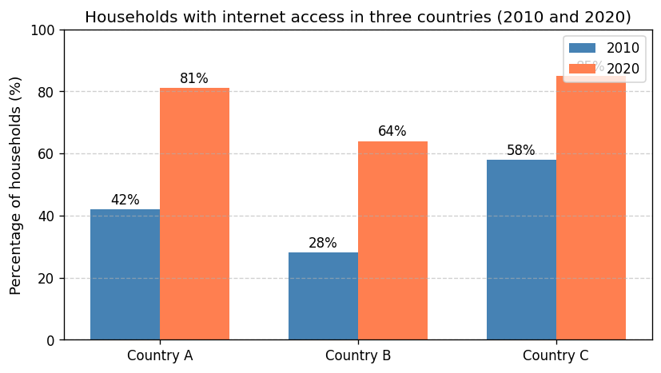

# IELTS Task 1 Report Practice

**日付**: 2026-03-04
**練習回数**: #
**今日の意識ポイント**: ① **冠詞**（可算単数に a/the、固有名詞に the 不要、この議論で出てきたものは the） ② 170語で止める ③ 意見・理由（Why）を書かない（What だけ）

---

## 問題文 / データの説明

> The table below shows the percentage of households in three countries (A, B and C) that had internet access in 2010 and 2020.
>
> Summarise the information by selecting and reporting the main features, and make comparisons where relevant.

**データ種類**: [ ] 折れ線グラフ  [x] 棒グラフ（表データを図化）  [ ] 円グラフ  [ ] 表  [ ] 地図  [ ] プロセス図

### 図（この図を見て記述すること。本番同様、図から情報を読み取る）

*画像が表示されない場合は同フォルダの `2026-03-04_task1_chart.png` を開く。*

---

## 構成メモ（3分）

- **全体傾向（Overview — 方向まで書く）**:
Overall, the percntages increased markedly
- **Detail 1で述べること**:
Country A and B increased significantly

A: 42 to 81, which is twice as the former value
Country B was 64%
doubled by the figure in 2010
Smallest number among three countries

- **Detail 2で述べること**:
although it is the highest, increased less than the others
C: increased by 27% (58 to 85), largest igure over the periods.

**繰り返しそうな語の3語セット**:
- percentage = share = proportion

---

## Report（17分 — 170語を目安に止める）

### Introduction（問題文の言い換え）
The bar chart in the picture represents the shares of households with internet access in countries A, B and C in 2010 and 2020.

### Overview（全体傾向 — 最重要パラグラフ）
Overall, in all countries, the percentages increased significantly, while the ranges of rising depend on each country.
6:40で終わり

### Detail 1
Especially, in countries A and B, the share doubled after the 10 years from 2010.
The figure of country A was 42% which was in the second place. Consecuently, in 2020, the percentage rose to 81% which was also in the second place.
Similar to A, the proportion in country B grew sharply from 28% to 64%. 
Although the figure was the smallest number among three countries, the ratio of incrementation was the largest in them.

### Detail 2
Contrary to the other countries, the percentages of country C increased markedly, but the range was less than those of the others.
Having share of 58% in 2010, which was the largest number within three countries, it reached 85% in 2020.
Although it grew up to 27%, the ratio against the former value in 2010 was slightly less than those of the other countries.

17:30で描きおわり
20:30でおしまい
---

## 語数: 約195語（目標: 150–180語）※やや多め。次回は170語で止める。

---

## AI フィードバック（2026-03-04）

### 1. 総評
**良かった点**: 図を見て 3 か国・2 時点をきちんと押さえている。Overview で「全か国で増加」「伸び幅は国ごとに異なる」と方向まで書けており、Detail 1（A・B）と Detail 2（C）の分担も明確。意見・理由の混入はなし。冠詞も Country A/B/C に the をつけていない。
**最優先で直す点**: **Detail 2 の「it grew up to 27%」はデータの誤り**。C は 58%→85% なので「増加幅は 27 ポイント」であり、「値が 27% になった」ではない。**increased by 27 percentage points** と書く。あわせてスペル（Consecuently）、冠詞（a share）、前置詞（figure for）、語選択（incrementation → rate of increase）を次回までに固める。

---

### 2. フォーマット照合（Task 1 比較・時点）
| 項目 | 判定 |
|------|------|
| Introduction → Overview → Detail 1 → Detail 2 | ✓ |
| Overview で全体傾向 2〜3 点（方向まで） | ✓ |
| Detail 1＝増えた／伸びが大きい（A・B）、Detail 2＝C（伸び幅は小） | ✓ |
| 全カテゴリ（3か国）に触れている | ✓ |
| 意見・理由（Why）の混入 | なし ✓ |

---

### 3. 推定スコア

| 基準 | スコア | 一言根拠 |
|------|--------|----------|
| Task Response | 5.5–6.0 | 1箇所データの言い方誤り（27%の意味）。他は要約・比較とも適切。 |
| Coherence & Cohesion | 6.0–6.5 | 段落の役割が明確。Especially / Similar to / Contrary to で流れあり。 |
| Lexical Resource | 5.5–6.0 | スペル1、語選択（incrementation, ranges of rising）で減点。 |
| Grammatical Range & Accuracy | 5.5–6.0 | 冠詞1、前置詞、時制（depend→depended）で減点。 |
| **総合** | **約 5.75–6.0** | データ表現の1箇所を直せば 6.0 に届く。 |

---

### 4. 致命傷チェック（Task 1）
- 意見・原因（Why）の混入: なし ✓  
- Overview 欠落: なし ✓  
- **データ・増減の誤り**: △ **「it grew up to 27%」** → C の値は 85%。増加**幅**が 27 ポイントなので **increased by 27 percentage points** と書く。  
- 時制: Overview の "depend" → 過去データなので **depended** または **varied**。

---

### 5. エラー修正テーブル

| 原文 | 修正 | 理由（ルール） |
|------|------|----------------|
| Consecuently | **Consequently** | スペル。 |
| the figure **of** country A | the figure **for** Country A | 数値・割合の主体は **the figure for X**。 |
| after the 10 years from 2010 | **over the 10-year period** / **between 2010 and 2020** | 期間の言い方。 |
| the ranges of rising **depend** on each country | the **extent of the increase** **varied** (or **differed**) across the three countries | 「伸びの幅は国ごとに異なる」。range of rising は不自然。時制は過去で統一。 |
| the smallest **number** among three countries | the lowest **figure** (or **percentage**) among the three countries | 割合は figure / percentage。the three を忘れない。 |
| the ratio of **incrementation** | the **rate of increase** / **growth rate** | incrementation はほとんど使わない。 |
| **in them** | **among them** | 3者のうちでは among。 |
| Having **share** of 58% | Having **a share** of 58% | 可算名詞の単数に a。 |
| **it grew up to 27%** | **it increased by 27 percentage points** (or **it rose to 85%, an increase of 27 percentage points**) | **致命傷に近い**。C は 58%→85%。「27% になった」ではなく「27ポイント増えた」。 |

**カウント**: 冠詞 1（a share）/ スペル 1（Consecuently）/ SVA 0 / データ表現 1（grew up to 27%）/ 語選択・時制 4

---

### 6. 良かった表現
- **the bar chart … represents the shares of** — Introduction の言い換えができている。
- **Country A, B and C** に the をつけていない（固有名詞）✓
- **Similar to A, the proportion in Country B grew sharply from 28% to 64%** — 数値・方向とも正確。
- **Although the figure was the smallest … the ratio … was the largest** — 対比がはっきりしている（語だけ直せば◎）。

---

### 7. 語数・時間
- **語数**: 約195語（目標 150–180）。15〜20語削ると 175 前後。Detail の「Although …」の文を1文にまとめるなどで調整可能。
- **時間**: 17分30秒で執筆終了は良いペース。見直しで「増加幅 vs 値」の確認を必ず入れる。

---

### 8. 安全語彙・言い換え
| 不安な語 | 安全な言い換え |
|----------|----------------|
| incrementation | rate of increase / growth |
| the range of the rise | the extent of the increase |
| grew up to 27% | increased by 27 percentage points / rose to 85% |

---

### 9. 次回の意識ポイント（3つだけ）
1. **「増加幅」と「値」を混同しない** — 「27% になった」ではなく「27ポイント増えた」は **increased by 27 percentage points**。数値を書いたら図と照合する。
2. **冠詞** — 可算単数に a（a share, a 10-year period）。the figure **for** Country X。
3. **170語で止める** — Overview は2文、Detail は各3〜4文を目安に。書いたあと語数を数え、超えそうなら1文削る。

---

## 自己レビュー（5分）

### スペルチェック（最初の1分 — 文字面だけ見る）
- [ ] 確認した

### チェック項目
- [ ] 問題文をそのままコピーせず言い換えたか
- [ ] Overviewで全体傾向を2-3点（方向まで）述べたか
- [ ] 主要なデータポイントを取り上げたか
- [ ] 自分の意見を書いていないか（What だけ。Why は書かない）
- [ ] 時制: 過去のデータは過去形で統一しているか
- [ ] **冠詞**: 可算名詞の単数に a/an、この表で話題の数値・国は the、Country A/B/C に the 不要
- [ ] SVA: 動詞の主語は単数？複数？

### 修正箇所

| 元の文 | 修正後 | 修正理由 |
|---|---|---|
| | | |
| | | |

---

## 振り返り（2分）

**良かった点**:

**改善が必要な点**:

**次回の意識ポイント**:

**新しく使った/学んだ表現**:
-
-

---
---

# ↓ ここから先は FB を受けた後に使う ↓

---

## 添削（FB を踏まえて、時間制限なしでじっくり直す）

### 添削の観点
1. **削れる文はないか？**
2. **FBで指摘されたミスを自分の手で直す**
3. **180語以内に収まるか？**

### 添削後のレポート

（ここに元のレポートをコピーして、直接修正する）

### 添削で気づいたこと
-
-

---

## クリーンリライト（何も見ずに17分で書く）

※ 下記は **FB反映済みのモデル例**。まず自分で何も見ずに書いてから比較するか、この例を「添削後の清書」として使ってよい。

### Introduction
The bar chart shows the percentage of households with internet access in Country A, Country B and Country C in 2010 and 2020.

### Overview
Overall, the figure increased in all three countries over the period. The extent of the increase varied: Country C had the highest share in both years, while Country B had the lowest in both years.

### Detail 1
In Country A and Country B, the share roughly doubled over the 10-year period. The figure for Country A was 42% in 2010, the second highest, and rose to 81% in 2020, remaining in second place. Similarly, the proportion in Country B grew sharply from 28% to 64%. Although Country B had the lowest figure among the three countries in both years, its rate of increase was the largest among them.

### Detail 2
By contrast, the percentage for Country C increased by 27 percentage points from 58% to 85%. Having the highest share in 2010 (58%), it still had the highest in 2020 (85%). The growth rate of Country C, however, was slightly lower than that of the other two countries.

---

## 語数: 約175語

## リライトの振り返り

**FBで直した点の反映**:
- 「it grew up to 27%」→ **increased by 27 percentage points** に修正（増加幅と値を混同しない）
- Consecuently → Consequently、figure of → figure for、a share、extent of the increase varied、rate of increase、among them を反映
- 語数を約175語に収めた（Overview 2文、Detail 各3〜4文）

**まだ残っている課題**:
- 本番では自分で「増加幅」を正確に書けるよう、数値を書いたら必ず図と照合する習慣をつける
